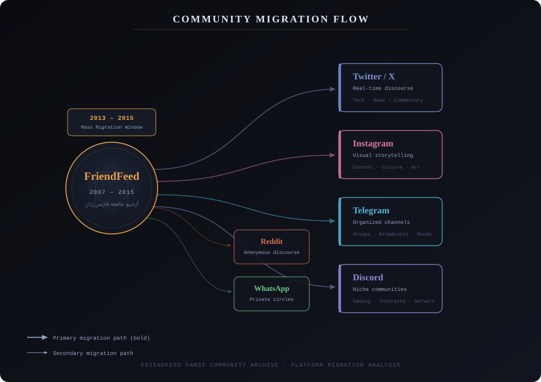
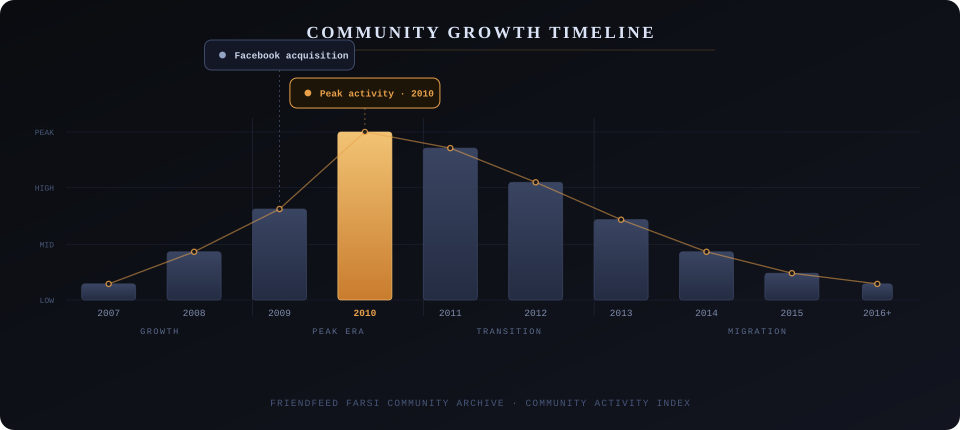
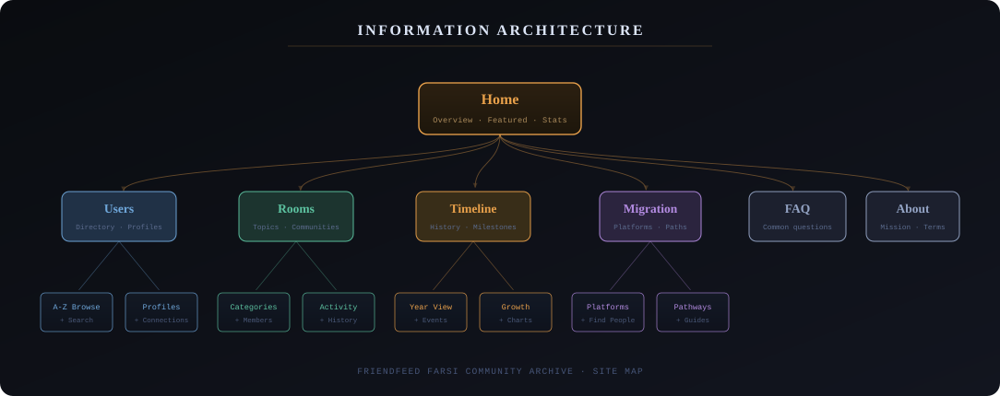
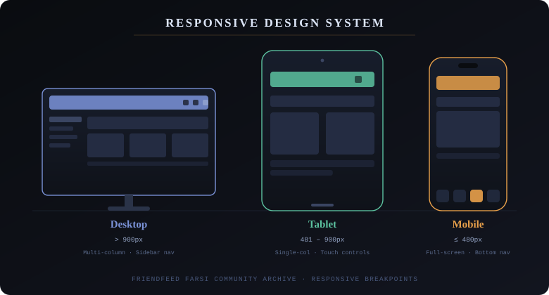
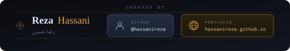

---

## What This Is

The **FriendFeed Farsi Community Archive** is a historical preservation project documenting the journey of Farsi-speaking internet users across social media platforms, beginning with FriendFeed in 2007.

This is a fully responsive web application that serves as a living record of one of the most significant chapters in Persian digital culture. It chronicles how a generation of early adopters discovered one another, formed communities, shaped online discourse, and ultimately migrated when the platform was acquired by Facebook in 2009.

The archive does not aim to be neutral. It takes a deliberate position: this history matters, and it deserves documentation built with the same care the community itself brought to the platform.

---

## The Story It Tells

### Where It Started

In 2007, FriendFeed launched as something genuinely new: a social aggregator that pulled activity from multiple platforms into a single, unified stream. It was technically ahead of its time and socially even further ahead. For Persian-speaking internet users scattered across geographies and time zones, FriendFeed became the first place where they could find each other at scale.

Before FriendFeed, the Farsi community online was fragmented. Blogs existed. Forums existed. But there was no place where a tech writer in Tehran, a student in Toronto, and a journalist in Berlin could inhabit the same conversation at the same moment. FriendFeed created that place.

### What Grew There

Between 2008 and 2010, the Farsi community on FriendFeed underwent explosive growth. Rooms, which were FriendFeed's version of thematic spaces, became the organizational backbone of the community. Technology rooms hosted some of the most sophisticated Persian-language discussions about the internet happening anywhere. Literary rooms, political rooms, humor rooms, regional rooms. An entire ecosystem of discourse organized itself around a feed.

By 2010, the community had reached its peak. Social hierarchies had formed. Influential voices had emerged. The platform had become genuinely load-bearing for how Persian-speaking people connected with ideas and with each other online.

### What Happened Next

Facebook's acquisition of FriendFeed in 2009 set in motion a slow dissolution. Features were not developed. The platform was not promoted. Users who wanted the future that FriendFeed had promised found they had to go find it themselves, on other platforms, in fragments.

The migration was not a single event. It happened over years, in waves, differently depending on what someone wanted from a social platform. Tech-focused users moved toward Twitter. Visual creators found Instagram. Organized communities rebuilt themselves on Telegram channels. Niche groups splintered further into Discord servers. The unified feed became a diaspora.

The archive documents this not as a tragedy but as a history. The connections formed on FriendFeed did not end when people left it. They transformed.

---

## Community Growth at a Glance

The timeline above shows community activity from launch through post-migration. The 2010 peak represents not just user count but the density and quality of interaction. The subsequent decline reflects platform stagnation more than community disengagement. The community relocated; it did not disappear.

---

## Exploring the Archive

The website organizes the archive across six primary sections, each serving a distinct purpose for different kinds of visitors.

**Home** provides an overview of the archive's scope, featured community stories, and aggregate statistics that give a sense of scale before diving deeper.

**Users** is a searchable, browsable directory of Farsi-speaking FriendFeed members. Each profile preserves participation history, room memberships, social connections, and activity patterns. The directory supports both alphabetical browsing and keyword search.

**Rooms** documents the thematic communities that gave FriendFeed its social texture. Room listings are organized by category, with member lists and activity history for each.

**Timeline** presents the platform's history as a chronological record of events, community milestones, and technological shifts. A year-view format allows visitors to understand what was happening at any particular moment.

**Migration** maps where the community went after FriendFeed's decline. It functions as a practical guide for visitors trying to reconnect with people they knew, as well as an analytical record of how different user types dispersed differently.

**FAQ** addresses the questions most visitors arrive with: what FriendFeed was, who used it, why it matters, how to find someone from that era.

---

## Site Architecture

---

## Built for Every Screen

The archive is a full progressive web application, designed from the beginning to work equally well across device types. Preservation work fails if access is limited to a single device category.

On desktop, the multi-column layout with persistent sidebar navigation allows for efficient browsing across large datasets. On tablets, the layout collapses to a single column while preserving the full feature set. On mobile, a bottom navigation bar and thumb-accessible touch targets make the full archive usable one-handed.

The application is built with React and TypeScript, bundled with Vite, and delivered as a static PWA. This architecture ensures the archive remains accessible and performant regardless of server conditions, and that it can be preserved and re-hosted as web infrastructure evolves.

---

## Technical Foundation

The application is built on a stack chosen for longevity and reliability rather than novelty.

**React** provides the component-based architecture that allows the user directory, room listings, and timeline to share rendering logic while maintaining distinct interfaces. **TypeScript** enforces the type safety that makes a codebase maintainable over years rather than months. **Vite** handles bundling with a build performance that keeps iteration fast during development and output clean in production.

The static generation approach is a deliberate preservation decision. Archives should not depend on running servers. The application generates its output as a set of static files that can be served from any environment and remain accessible even if the original hosting disappears.

---

## License

This archive is provided for historical documentation and research purposes only. All rights are reserved.

The content of this archive may not be used for any commercial purpose, redistributed or republished without written permission, used to build derivative databases or services, systematically extracted or scraped, or used to identify, contact, or monitor individuals.

Academic and research use is permitted when non-commercial, properly attributed, and conducted in accordance with ethical standards for handling personal information.

User-generated content preserved in this archive was originally published on FriendFeed under its original terms of service. FriendFeed and associated trademarks are the property of Meta Platforms, Inc. The archive compilation, structure, and presentation are protected by copyright. All rights are reserved by the archive creators.

By accessing this archive, you agree to all terms and conditions outlined in the `LICENSE` file.

---

*Preserving the history of the Persian internet.*

